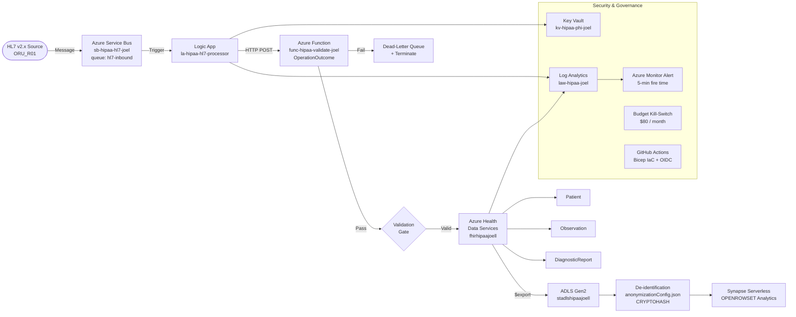

# Azure Healthcare FHIR Integration Pipeline

**End-to-end HL7 v2.x to FHIR R4 transformation pipeline on Azure — HIPAA-compliant, IaC-deployed, CI/CD automated.**


---

## Overview

This repository documents a 10-week, self-directed build project implementing a production-pattern healthcare integration pipeline on Microsoft Azure. The pipeline ingests HL7 v2.x `ORU^R01` lab result messages, transforms them to FHIR R4 resources, validates them through a custom quality gate, persists them in Azure Health Data Services, and exports de-identified NDJSON to an analytics layer — all deployed from code, with zero stored secrets and a compliance gate enforced at every deployment.

**Problem:** HL7 v2.x medical devices cannot natively connect to FHIR-based EHRs and analytics platforms. Bridging that gap in a HIPAA-compliant, auditable, and reproducible way requires cloud-native orchestration, structured identity management, and a validation layer that prevents invalid clinical data from propagating downstream.

**Solution:** A fully integrated Azure pipeline using Logic Apps, Azure Functions, Azure Health Data Services, Bicep IaC, and GitHub Actions CI/CD — with HIPAA controls enforced at the infrastructure level, not as a post-deployment checklist.

---

## Architecture



> Full architecture diagram: [`/docs/architecture-diagram.png`](./docs/architecture-diagram.png)
---

## Tech Stack

| Component | Technology |
|---|---|
| Message Broker | Azure Service Bus — `sb-hipaa-hl7-joel`, queue `hl7-inbound` |
| Orchestration | Azure Logic Apps (Consumption) — `la-hipaa-hl7-processor` |
| HL7 Transformation | Azure Health Data Services `$convert-data` — `ORU_R01` Liquid template |
| FHIR Server | Azure Health Data Services — `fhirhipaajoell` (workspace `ahdshipaajoell`) |
| Validation | Azure Functions (Python 3.11) — `func-hipaa-validate-joel` + FHIR `OperationOutcome` |
| Infrastructure as Code | Bicep — `/iac` folder, full pipeline coverage |
| CI/CD | GitHub Actions — 5-job pipeline, OIDC federated identity, zero stored secrets |
| Analytics | Azure Synapse Serverless — `OPENROWSET` over de-identified NDJSON |
| De-identification | AHDS anonymization pipeline — `anonymizationConfig.json`, `CRYPTOHASH` + `redact` |
| Secret Management | Azure Key Vault — `kv-hipaa-phi-joel`, RBAC access model |
| Audit Trail | Log Analytics — `law-hipaa-joel`, KQL queries for PHI access patterns |
| Identity | Azure Entra ID — SMART on FHIR scopes, OIDC federated identity for CI/CD |

---

## Project Highlights

- **Bulk export validated:** `$export` produced 3 Patient + 2 Observation NDJSON records from `fhirhipaajoell` with `202 Accepted` polling and `200 OK` completion confirmed
- **CI/CD pipeline green:** GitHub Actions 5-job pipeline — `lint` → `validate` → `deploy` → `smoke-test` → `fhir-validate` — all jobs passing, with Azure Policy compliance gate blocking deployment on any HIPAA tag violation
- **De-identification confirmed:** `name` and `birthDate` redacted with `CRYPTOHASH` across all 3 Patient records; `anonymizationConfig.json` committed to repo as a reusable template
- **Zero standing access:** OIDC federated identity between GitHub Actions and Azure — no client secrets, no subscription keys stored in any GitHub secret
- **FHIR CapabilityStatement published:** Retrieved from `/metadata`, committed to `/docs/capability-statement.json`, documenting all supported FHIR interactions for the deployed server

---

## AI Data Readiness

This pipeline is designed as the **data governance foundation required before deploying clinical AI responsibly.**

Clean, validated, de-identified FHIR data is not just an interoperability output — it is the prerequisite layer that most clinical AI projects fail to get right before a model reaches a clinical workflow.

This pipeline provides:

- **De-identified NDJSON export** ready for ML training pipelines — `name`, `birthDate`, and other direct identifiers removed per HIPAA Safe Harbor method 2
- **OperationOutcome validation gate** ensuring every FHIR resource passing to the analytics layer is structurally valid — invalid resources are dead-lettered, not silently passed downstream
- **Full audit lineage via Log Analytics** — every FHIR read and write operation captured, providing traceable data provenance for any model consuming this data
- **CRYPTOHASH de-identification** aligned with HIPAA Safe Harbor method 2 — the foundational control required under the FDA AI/ML Software as a Medical Device (SaMD) action plan for training data governance

> Reference: [FDA AI/ML-Based SaMD Action Plan](https://www.fda.gov/medical-devices/software-medical-device-samd/artificial-intelligence-and-machine-learning-software-medical-device)

---

## Repository Structure

```
azure-fhir-pipeline/
│
├── .github/
│   └── workflows/
│       └── deploy-pipeline.yml       # 5-job CI/CD: lint, validate, deploy, smoke-test, fhir-validate
│
├── iac/                               # Bicep Infrastructure as Code
│   ├── main.bicep                     # Orchestration template
│   ├── modules/                       # Per-service Bicep modules
│   └── parameters/                    # Environment parameter files
│
├── functions/                         # Azure Functions (Python 3.11)
│   └── validate_fhir/                 # FHIR validation - returns OperationOutcome
│
├── docs/                              # Architecture and compliance artefacts
│   ├── architecture-diagram.png       # Full pipeline architecture diagram
│   ├── architecture-overview.md       # Mermaid source + component narrative
│   └── capability-statement.json      # AHDS FHIR CapabilityStatement
│
├── fhir-samples/                      # Reference HL7 and FHIR examples
│   ├── sample-oru-r01.hl7             # Synthetic ORU_R01 lab result message
│   └── sample-fhir-output.json        # Corresponding FHIR R4 bundle output
│
├── week01-foundation/                 # Azure Core Architecture - RG, Key Vault, HIPAA tags, budget
├── week02-hipaa-compliance/           # HIPAA Policy, Log Analytics, Monitor alert, action group
├── week03-hl7-integration/            # Service Bus, HL7 source simulation, Logic App trigger
├── week04-fhir-transform/             # AHDS workspace, $convert-data, ORU_R01 template
├── week05-pipeline/                   # End-to-end Logic App, Service Bus to FHIR post
├── week06-fhir-search/                # DiagnosticReport, Observation, FHIR search queries
├── week07-smart-on-fhir/              # Entra ID app, SMART scopes, OIDC token flow, Postman
├── week08-ehr-validation/             # Validation Function, OperationOutcome, quality gate
├── week09-analytics/                  # $export, ADLS Gen2, Synapse serverless, de-identification
├── week10-iac-cicd/                   # Bicep IaC, GitHub Actions 5-job pipeline, Azure Policy
│
├── anonymizationConfig.json           # AHDS de-identification config (CRYPTOHASH + redact rules)
├── openrowset-query.sql               # Synapse Serverless query against de-identified NDJSON
├── CONTRIBUTING.md                    # Folder conventions, naming standards, HIPAA tagging rules
├── .gitignore                         # Python + Azure defaults
└── README.md                          # This file
```

---

## Quick Start

These three commands let any reviewer validate the deployment without touching the Azure portal.

**1. Authenticate**
```bash
az login
az account set --subscription "<your-subscription-id>"
```

**2. Validate the IaC (what-if — no resources created)**
```bash
az deployment group what-if \
  --resource-group rg-hipaa-apps \
  --template-file iac/main.bicep \
  --parameters iac/parameters/lab.json
```

**3. Smoke test the FHIR endpoint**
```bash
# Get a Bearer token (requires az CLI logged in with FHIR Data Reader role)
TOKEN=$(az account get-access-token \
  --resource https://fhirhipaajoell.fhir.azurehealthcareapis.com \
  --query accessToken -o tsv)

# Query the CapabilityStatement
curl -s -H "Authorization: Bearer $TOKEN" \
  https://fhirhipaajoell.fhir.azurehealthcareapis.com/metadata \
  | python3 -m json.tool | head -30
```

> The FHIR server `fhirhipaajoell` is a lab environment. Access requires appropriate RBAC assignment in the Azure subscription.

---

## Compliance and Security

### HIPAA Tagging Strategy

All 10 Azure resources carry mandatory HIPAA tags enforced via Azure Policy (deny effect — deployment fails without them):

| Tag | Value |
|---|---|
| `DataClassification` | `PHI` |
| `ComplianceFramework` | `HIPAA` |
| `Environment` | `Lab` |
| `Owner` | `Joel` |

### Secret Management

- All secrets stored in `kv-hipaa-phi-joel` — no connection strings in Logic App app settings or environment variables
- Key Vault uses RBAC access model (not legacy vault access policies)
- GitHub Actions uses OIDC federated identity — zero client secrets stored in GitHub

### Audit Trail

- All Azure service diagnostic logs route to `law-hipaa-joel` (Log Analytics)
- KQL queries capture every FHIR read, write, and export operation
- Every dead-letter event is logged — providing a complete record of messages that did not reach the FHIR server

### Cost Control Architecture

The pipeline uses a two-layer cost control pattern — because Azure budget alerts have a 12-24 hour billing lag and cannot protect against a runaway Logic App execution loop in real time:

| Layer | Mechanism | Fire Time |
|---|---|---|
| Primary | Azure Monitor alert on Logic App `RunsFailed > 5` over 5 min | ~5 minutes |
| Backstop | Budget alert at 50% / 80% / 99% of $80/month | 12-24 hours |

---

## Week-by-Week Build Summary

| Week | Focus | Key Deliverable |
|---|---|---|
| W1 | Azure Core Architecture | Resource group, Key Vault, HIPAA tag policy, $80 budget with kill-switch |
| W2 | HIPAA Compliance | Log Analytics workspace, Monitor alert (5-min fire), action group, budget thresholds |
| W3 | HL7 Integration | Service Bus (`sb-hipaa-hl7-joel`), Logic App trigger, HL7 source simulation |
| W4 | FHIR Transformation | AHDS workspace (`ahdshipaajoell`), `$convert-data`, ORU_R01 Liquid template |
| W5 | End-to-End Pipeline | Logic App (`la-hipaa-hl7-processor`) wired Service Bus to FHIR post |
| W6 | FHIR Search and DiagnosticReport | Patient + Observation + DiagnosticReport (LOINC-coded), FHIR search queries |
| W7 | SMART on FHIR | Entra ID app (`fhir-client-joel`), SMART scopes, OIDC token flow, Postman validation |
| W8 | EHR Integration and Data Quality | Validation Function (`func-hipaa-validate-joel`), OperationOutcome quality gate |
| W9 | Bulk Export and Analytics | `$export` to ADLS Gen2, de-identification (CRYPTOHASH), Synapse OPENROWSET, CDS Hooks doc |
| W10 | DevOps, IaC, and CI/CD | Bicep IaC, GitHub Actions 5-job pipeline, OIDC, Azure Policy gate, CapabilityStatement |

---

## Author

**Joel Onwuemene**
Senior Healthcare IT Architect | FHIR | HL7 | Azure | Epic | Cerner

[](https://www.linkedin.com/in/joel-onwuemene)

---

## License

[MIT License](./LICENSE)
