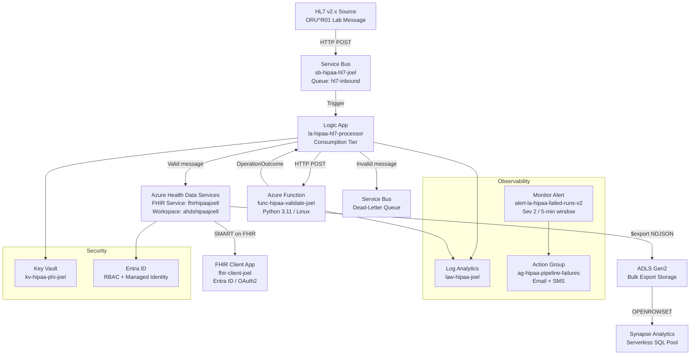

# Azure FHIR Pipeline - Architecture Overview

**Author:** Joel Onwuemene  
**Certifications:** Azure Solutions Architect Expert (AZ-305) | MSc Medical Informatics  
**Project Duration:** 12 Weeks (W1-W12) | Weeks 1-9 Complete  
**Compliance Scope:** HIPAA, GDPR, FDA 21 CFR Part 11

---

## Project Summary

This portfolio project demonstrates a production-grade HL7-to-FHIR integration pipeline built entirely on Azure. It ingests HL7 v2.x messages (ORU^R01 lab results), validates and transforms them to FHIR R4 resources, persists them in Azure Health Data Services, and exposes them for analytics via Azure Synapse. The architecture reflects real-world clinical integration patterns used in acute-care and laboratory settings.

**Key outcomes delivered:**
- End-to-end HL7 v2.x to FHIR R4 transformation (Patient, Observation, DiagnosticReport)
- HIPAA-compliant pipeline with envelope encryption, audit logging, and dead-lettering
- SMART on FHIR OAuth2 token flow validated via Postman and jwt.ms
- Bulk FHIR export ($export) with de-identification (name, birthDate redacted, CRYPTOHASH tags)
- FHIR analytics via Synapse serverless SQL using OPENROWSET over NDJSON in ADLS Gen2
- Full Infrastructure-as-Code in Bicep (W10)
- GitHub portfolio with weekly reflections and architecture documentation

---

## End-to-End Architecture



---

## Azure Resources

| Resource | Name | Type | Region |
|---|---|---|---|
| Resource Group | `rg-hipaa-apps` | Resource Group | East US |
| AHDS Workspace | `ahdshipaajoell` | Health Data Services | East US |
| FHIR Service | `fhirhipaajoell` | FHIR R4 | East US |
| Logic App | `la-hipaa-hl7-processor` | Consumption | East US |
| Azure Function | `func-hipaa-validate-joel` | Consumption / Python 3.11 | East US |
| Function Storage | `stfunchipaajoell` | Storage Account | East US |
| Service Bus | `sb-hipaa-hl7-joel` | Standard | East US |
| Key Vault | `kv-hipaa-phi-joel` | Key Vault | East US |
| Log Analytics | `law-hipaa-joel` | Log Analytics Workspace | East US |
| Entra ID App | `fhir-client-joel` | App Registration | Global |
| Monitor Alert | `alert-la-hipaa-failed-runs-v2` | Metric Alert | East US |
| Action Group | `ag-hipaa-pipeline-failures` | Action Group | Global |
| Synapse Workspace | Ephemeral (W9 only) | Serverless SQL | West US 2 |
| ADLS Gen2 | Bulk export storage | Storage Account | East US |

**Standard HIPAA tags applied to all resources:**

```json
{
  "DataClassification": "PHI",
  "ComplianceFramework": "HIPAA",
  "Environment": "Lab",
  "Owner": "Joel"
}
```

---

## Pipeline Detail

### 1. Ingestion: Service Bus

HL7 v2.x messages arrive as Base64-encoded payloads on the `hl7-inbound` queue. Service Bus provides durable buffering, at-least-once delivery guarantees, and a dead-letter queue for messages that fail validation. The Logic App trigger reads `triggerBody()?['ContentData']` directly from the Consumption tier connector.

### 2. Orchestration: Logic App

`la-hipaa-hl7-processor` is the pipeline conductor. It:

1. Receives the Service Bus message trigger
2. POSTs the payload to the validation function
3. Parses the `OperationOutcome` response
4. Evaluates `length(body('Parse_OperationOutcome')?['issue']) == 0` to determine pass/fail
5. On pass: POSTs the transformed FHIR Bundle to `fhirhipaajoell`
6. On fail: dead-letters the message and terminates

**Key lessons learned:**
- All Logic App definition changes must be saved via Designer only. Code View and CLI saves do not reliably persist to the live definition on the Consumption tier.
- `ContentData` from Service Bus requires `triggerBody()?['ContentData']` without array index notation.
- Content-Type headers require body serialization via `string()` in a Compose action to prevent silent stripping.

### 3. Validation: Azure Function

`func-hipaa-validate-joel` (Python 3.11, Linux, Consumption plan) receives the HL7 payload and returns a FHIR `OperationOutcome`. An empty `issue` array signals a valid message. Issues are classified by severity (`error`, `warning`, `information`) per the FHIR R4 spec.

### 4. FHIR Persistence: Azure Health Data Services

FHIR R4 resources written to `fhirhipaajoell`:

- **Patient** - demographics mapped from PID segment
- **Observation** - lab results mapped from OBX segments (LOINC-coded)
- **DiagnosticReport** - report envelope referencing Patient and Observation resources

SMART on FHIR OAuth2 token flow is implemented via `fhir-client-joel` (Entra ID app registration), validated using Postman (`fhir-env` environment) and jwt.ms for token inspection. Azure Health Data Services enforces scope at token issuance via Entra ID; scope enforcement does not occur at the FHIR resource level.

**Important constraint:** AHDS does not support conditional references in resource fields. All references use direct server-assigned resource IDs.

### 5. Analytics: Bulk Export and Synapse

The FHIR `$export` operation produces NDJSON files written to ADLS Gen2. W9 validated:
- 3 Patient resources exported
- 2 Observation resources exported
- De-identified export: `name` and `birthDate` fields redacted, CRYPTOHASH tags applied
- Synapse serverless SQL pool queried via `OPENROWSET` (see [`src/fhir/analytics/openrowset-query.sql`](../src/fhir/analytics/openrowset-query.sql))

### 6. Observability

| Component | Configuration |
|---|---|
| Log Analytics | All Logic App and Function telemetry streamed to `law-hipaa-joel` |
| Monitor Alert | `alert-la-hipaa-failed-runs-v2`: `RunsFailed > 5` over 5 minutes, Severity 2 |
| Action Group | Email (`joel.azurearchitect@proton.me`) and SMS (`Joel-Azure-Alert`) |
| Budget | $80 cap, thresholds at 50% / 80% / 99% |

---

## Security Architecture

| Control | Implementation |
|---|---|
| Secret management | All connection strings and keys in `kv-hipaa-phi-joel`. Logic App accesses via Managed Identity. |
| Identity | Entra ID RBAC. FHIR Data Contributor role on `fhirhipaajoell`. |
| Encryption | Azure-managed keys at rest. TLS 1.2 in transit. |
| Audit | All FHIR reads/writes captured in Log Analytics. |
| Dead-lettering | Failed messages isolated in Service Bus DLQ, never re-queued to main queue. |
| Budget kill switch | Monitor alerts fire within 5 minutes. Budget email alerts provide a secondary backstop (12-24 hour lag). |

---

## Compliance Mapping

| Requirement | Implementation |
|---|---|
| HIPAA § 164.312(a)(1) - Access Control | Entra ID RBAC, Managed Identity, no standing credentials |
| HIPAA § 164.312(b) - Audit Controls | Log Analytics workspace capturing all resource operations |
| HIPAA § 164.312(c)(1) - Integrity | Service Bus at-least-once delivery, FHIR conditional writes |
| HIPAA § 164.312(e)(2)(ii) - Encryption | TLS 1.2 in transit, Azure-managed encryption at rest |
| De-identification | AHDS anonymization config: name + birthDate redacted, CRYPTOHASH tags |

---

## Repository Structure

```
azure-fhir-pipeline/
├── docs/
│   ├── architecture/
│   │   └── architecture-overview.md       # This document
│   └── weekly-reflections/
│       ├── week-01.md                     # Azure Core Architecture
│       ├── week-02.md                     # HIPAA Compliance
│       ├── week-03.md                     # Integration Services and HL7
│       ├── week-04.md                     # FHIR Transformation
│       ├── week-05.md                     # End-to-End Pipeline
│       ├── week-06.md                     # FHIR Search and DiagnosticReport
│       ├── week-07.md                     # Logic App Enhancement and SMART on FHIR
│       ├── week-08.md                     # EHR Integration and Data Quality
│       ├── week-09.md                     # FHIR Analytics and Bulk Export
│       └── lessons-learned.md             # Accumulated technical learnings
├── infrastructure/
│   ├── bicep/
│   │   ├── main.bicep
│   │   ├── ahds.bicep
│   │   ├── keyvault.bicep
│   │   ├── loganalytics.bicep
│   │   └── servicebus.bicep
│   └── policies/
│       └── hipaa-tags-audit.json
├── src/
│   └── fhir/
│       ├── analytics/
│       │   └── openrowset-query.sql       # Synapse OPENROWSET query (W9)
│       ├── anonymization/
│       │   └── anonymizationConfig.json   # AHDS de-identification config
│       ├── sample-messages/               # HL7 v2.x ORU^R01 input samples
│       └── sample-output/                 # FHIR R4 JSON output samples
├── functions/
│   └── validate/                          # func-hipaa-validate-joel source
└── logic-apps/
    └── la-hipaa-hl7-processor/            # Exported Logic App definition
```

---

## Weekly Build Log

| Week | Theme | Key Deliverable |
|---|---|---|
| W1 | Azure Core Architecture | AHDS workspace, FHIR service, Key Vault, Log Analytics provisioned |
| W2 | HIPAA Compliance | HIPAA tags policy, budget alerts, Monitor alert configured |
| W3 | Integration Services and HL7 | Service Bus, Logic App trigger, HL7 message routing |
| W4 | FHIR Transformation | Patient and Observation resources written to FHIR service |
| W5 | End-to-End Pipeline | Full HL7 inbound to FHIR write pipeline operational |
| W6 | FHIR Search and DiagnosticReport | DiagnosticReport resource, FHIR search parameters validated |
| W7 | Logic App Enhancement and SMART on FHIR | OAuth2 token flow, SMART scopes, Postman validation |
| W8 | EHR Integration and Data Quality | Validation function wired as quality gate in Logic App |
| W9 | FHIR Analytics and Bulk Export | $export, NDJSON to ADLS Gen2, Synapse OPENROWSET, de-identification |
| W10 | DevOps, IaC, CI/CD | Bicep templates, GitHub Actions pipeline _(in progress)_ |
| W11 | GitHub Portfolio and Interview Prep | Full architecture deck, STAR stories, portfolio polish |
| W12 | LLC Formation and Consulting Launch | Practice entity, service offerings, consulting collateral |

---

## Technologies

`HL7 v2.x` `FHIR R4` `SMART on FHIR` `Azure Health Data Services` `Azure Logic Apps` `Azure Functions (Python)` `Azure Service Bus` `Azure Key Vault` `Azure Monitor` `Log Analytics` `ADLS Gen2` `Azure Synapse Analytics` `Bicep` `Entra ID` `OAuth2` `HIPAA` `GDPR`
