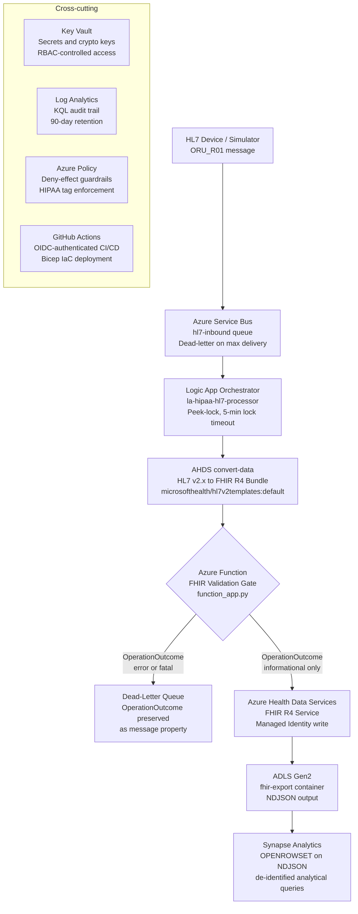

# Architecture Overview

## Design Goals

This pipeline solves a specific clinical integration problem: HL7 v2.x devices cannot write directly to FHIR-based EHR platforms. The transformation layer must be HIPAA-compliant, auditable, and capable of rejecting malformed clinical data before it reaches the FHIR store.

Three design principles drive every architectural decision:

**Validation before write.** A FHIR resource that converts successfully but contains invalid clinical data is more dangerous than one that fails outright. The pipeline enforces a $validate gate at the transformation layer. See [ADR-004](decisions/ADR-004-validation-gate-before-fhir-write.md).

**Audit trail at every boundary.** Every message that enters, transforms, validates, and exits the pipeline generates a log record in Log Analytics. A pipeline failure is never silent.

**Reproducible by design.** All infrastructure is parameterized Bicep. Resource names are prefix-driven. Any operator can deploy this pattern into their own subscription without modifying source files.

## Pipeline Flow

## Component Responsibilities

| Component | Responsibility | Key Design Decision |
|---|---|---|
| Service Bus | Durable HL7 message ingestion with dead-letter recovery | [ADR-001](decisions/ADR-001-service-bus-over-eventhub.md) |
| Logic App | Orchestration: receive, convert, validate, write | [ADR-002](decisions/ADR-002-logic-app-consumption-designer-save.md) |
| AHDS $convert-data | HL7 v2.x to FHIR R4 transformation | Requires `templateCollectionReference` parameter |
| Azure Function | Pre-write FHIR $validate gate | [ADR-004](decisions/ADR-004-validation-gate-before-fhir-write.md) |
| AHDS FHIR service | FHIR R4 store, $validate, $export | [ADR-003](decisions/ADR-003-ahds-over-api-for-fhir.md) |
| ADLS Gen2 | Bulk export landing zone for de-identified NDJSON | |
| Synapse Analytics | Analytical queries via OPENROWSET on FHIR NDJSON | Use exact file paths, not wildcards |
| Key Vault | Secret lifecycle, CRYPTOHASH key management | [ADR-006](decisions/ADR-006-cryptohash-de-identification.md) |
| Log Analytics | Pipeline audit trail and operational alerting | Monitor alert fires within 5 minutes |
| Azure Policy | Deny-effect compliance guardrails | HIPAA tag schema enforcement |
| GitHub Actions | OIDC-authenticated IaC deployment | [ADR-005](decisions/ADR-005-oidc-over-client-secret.md) |

## FHIR Resources Produced

Each ORU_R01 message produces three FHIR R4 resources:

| FHIR Resource | Source HL7 Segment | Key Fields |
|---|---|---|
| Patient | PID | identifier, name (redacted post-export), birthDate |
| Observation | OBX | code (LOINC), value, status, subject reference |
| DiagnosticReport | OBR | code (LOINC panel), result references, subject |

## Security Boundary

See [docs/security.md](security.md) for the full RBAC model, encryption posture, and audit trail design.

## Infrastructure as Code Coverage

| Component | Bicep Status |
|---|---|
| Log Analytics workspace | Deployed via `modules/loganalytics.bicep` |
| Service Bus namespace and queue | Deployed via `modules/servicebus.bicep` |
| Key Vault | Deployed via `modules/keyvault.bicep` |
| Azure Function App | Deployed via `modules/functionapp.bicep` |
| AHDS workspace and FHIR service | Manual provisioning required - see [deployment-guide.md](deployment-guide.md) |
| Logic App workflow | Manual Designer configuration required - see [ADR-002](decisions/ADR-002-logic-app-consumption-designer-save.md) |
| ADLS Gen2 | Planned for future Bicep coverage |
